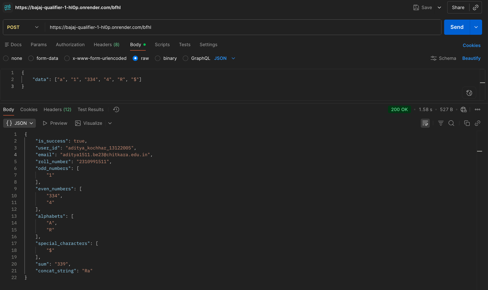
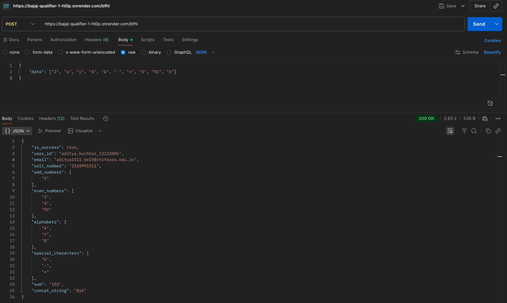
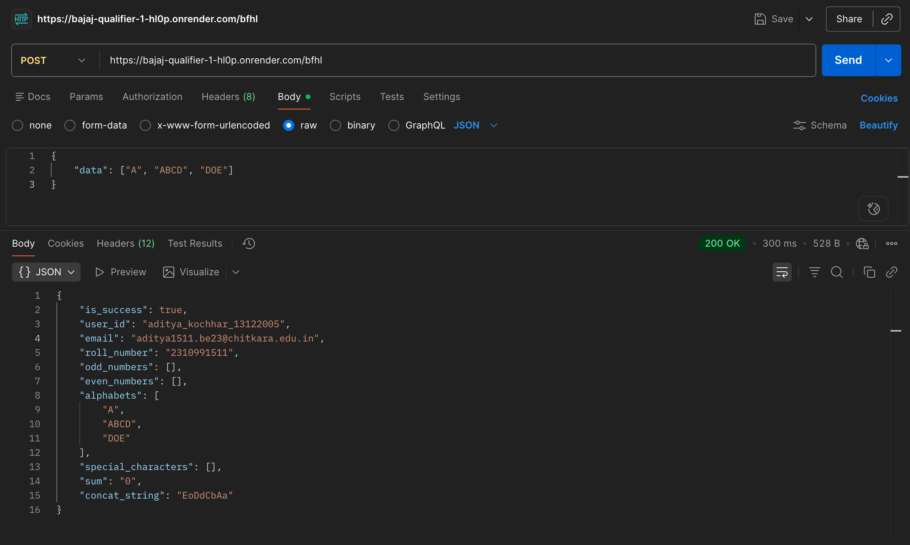
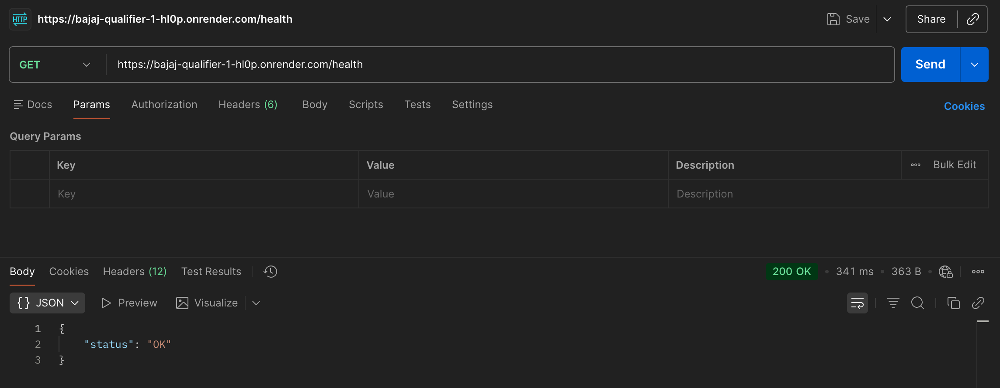

# Bajaj Qualifier 1 — BFHL API

Spring Boot REST API with:

* `POST /bfhl` — processes an array and returns categorized data
* `GET /health` — health check

---

## POST /bfhl

**Endpoint:** `POST /bfhl`

**Body:**
```json
{
    "data": ["a", "1", "334", "4", "R", "$"]
}
```

**Response:**
```json
{
    "is_success": true,
    "user_id": "aditya_kochhar_13122005",
    "email": "aditya1511.be23@chitkara.edu.in",
    "roll_number": "2310991511",
    "odd_numbers": ["1"],
    "even_numbers": ["334", "4"],
    "alphabets": ["A", "R"],
    "special_characters": ["$"],
    "sum": "339",
    "concat_string": "Ra"
}
```

---

## GET /health

**Endpoint:** `GET /health`

**Response:**
```json
{
    "status": "OK"
}
```

---

## Run locally

```bash
mvn clean package -DskipTests
java -jar target/bajaj-qualifier-1.0.0.jar
```

---

## Screenshots

### POST /bfhl — Example A


### POST /bfhl — Example B


### POST /bfhl — Example C


### GET /health

